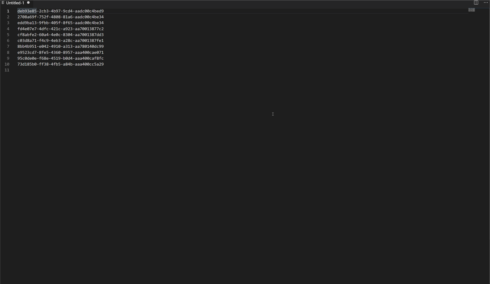

# List to IN Query Builder

Convert a list of new line separated values into an IN (..) expression for use in a SQL query.

## Quick Start

Select the rows of text (or no selection, to convert the entire document) and then via the command palette choose __Convert new lines into SQL IN Query__ to have the text replaced with an IN compatible SQL clause.

## Features

List to IN Query Builder in action on an example data set.

## Release Notes

See Changelog for details of release notes.

## Attributions
Icon made by Chanut (https://www.flaticon.com/authors/chanut) from www.flaticon.com
